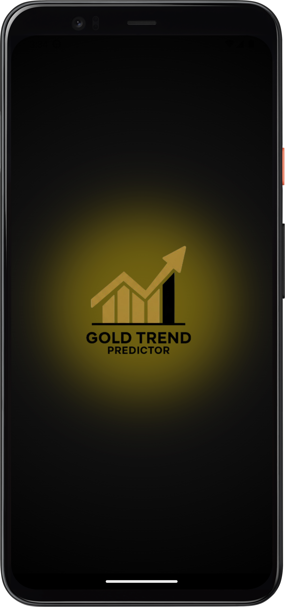
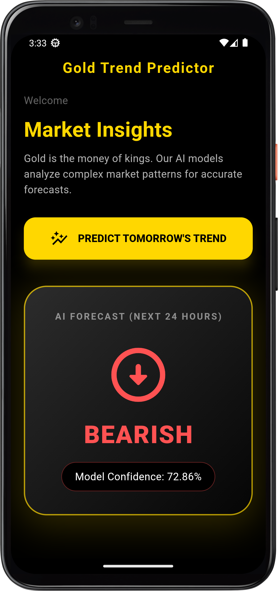
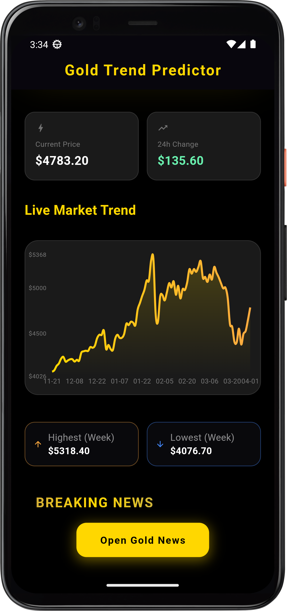
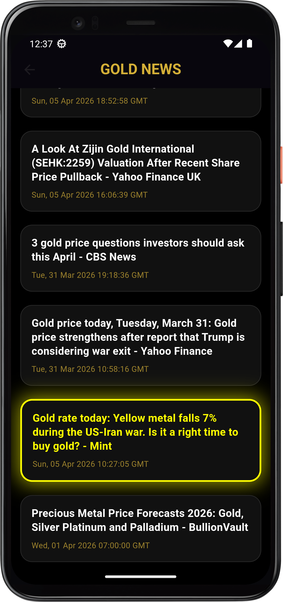

# 🪙 Gold Trend Predictor (AI Project)

An end-to-end Machine Learning pipeline designed to predict Gold Market trends (Bullish/Bearish) with high accuracy. This project includes a complete data Science workflow and a seamless Android integration for real-time insights.


## App Showcases
| Splash Screen | Market Insights | Live Charts | Global News |
| :---:   | :---: | :---: | :---: |
|   |    |    |   |


## Key Features
- ***AI Forecasting:*** Tomorrow's market trend prediction with model confidence scores.

- ***Live Market Data:*** Real-time gold prices and 24h price change tracking.

- ***Interactive Visuals:*** Dynamic price movement charts for technical analysis.

- ***Financial News:*** Integrated breaking news feed related to gold and global markets.

- ***DVC Pipeline:*** Robust data version control and automated training pipelines.


 ## Project Structure
***1_Project_Presentation:*** Complete project slides and Team members 

***2_DATA:*** Storage for datasets.

***3_EDA:*** Exploratory Data Analysis notebooks (Visualizations ).

***4_Hyperparameter_Tuning:*** Model optimization scripts and results.

***5_Model_Training_DVC_Pipeline:*** ML pipeline automation using DVC (Data Version Control).

***6_API:*** Backend service for model serving (FastAPI).

***7_Android_App:***ource code for the Flutter Android application.


## Team Roles & Responsibilities 
- Meraj : Responsible for data gathering, cleaning, and pre-processing to ensure high-quality input.
- Usman Khan : Focuses on training multiple models and selecting the best one with the highest accuracy.
- Mubashir : Responsible for building the DVC pipeline, developing the FastAPI, and integrating the model into the Android App.


## Tech Stack


### 💻 Languages & Frontend
* **Languages:**  **Python** | 
     **Dart** | 
* **Frontend:**  **Flutter** / 
     **Android Studio**

### 🧠 Machine Learning & Data
* **ML Libraries:**  **Pandas** | 
     **NumPy** | 
    **Scikit-learn** | **XGBoost**
* **Automation:** **DVC (Data Version Control)** 📦

### ⚙️ Backend & API
* **Backend:**  **FastAPI**


## Installation & Usage

### Clone the Repository:
```bash
git clone https://github.com/MubashirShafique/Gold-Trend-Predictor.git

```


### For Running DVC Pipeline
```bash
pip install dvc

```

```bash
dvc init --no-scm

```

```bash
# enter into Folder 
cd 5_Model_Training_DVC_Pipeline

# run Pipeline 
dvc repro

```


### API 
```bash
cd 6_API


pip install -r requirements.txt

python data_gathering.py

python api.py

```

### Launch Android App: Open 7_Android_App in your IDE and run on an emulator or physical device.


